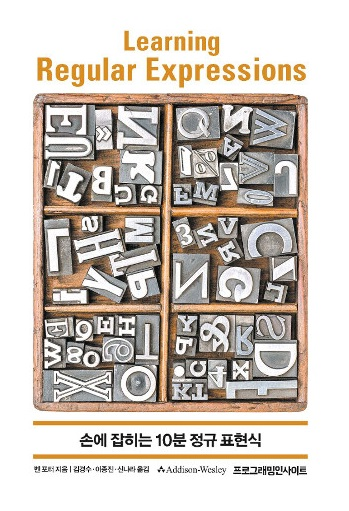

# 손에 잡히는 10분 정규 표현식 (Learning Regular Expressions)

`Regex` `Python`

## 개요

이 저장소는 **손에 잡히는 10분 정규 표현식**의 학습 내용을 정리하고 있습니다.

> Ben Forta

## 학습 목표
- 정규 표현식의 숙달

## 학습 내용
|No|목차|비고|
|---|---|---|
|01|정규 표현식 소개|요약 내용 無|
|02|[문자 하나 찾기](./02.MatchSingleCha.ipynb)||
|03|[문자 집합으로 찾기](./03.MatchSet.ipynb)||
|04|[메타 문자 사용하기](./04.Meta.ipynb)||
|05|[반복 찾기](./05.Repeat.ipynb)||
|06|[위치 찾기](./06.Position.ipynb)||
|07|[하위 표현식 사용하기](./07.Subexpressions.ipynb)||
|08|[역참조 사용하기](./08.Backreferences.ipynb)||
|09|[전방탐색과 후방탐색](./09.AheadAndBehind.ipynb)||
|10|[조건 달기](./10.Conditions.ipynb)||
|11|[정규 표현식으로 해결하는 일반적인 문제들](./11.CommonProblems.ipynb)||
|부록 A|[많이 쓰는 애플리케이션과 언어에서 활용하는 정규 표현식](./Appendix%20A.ipynb)||
